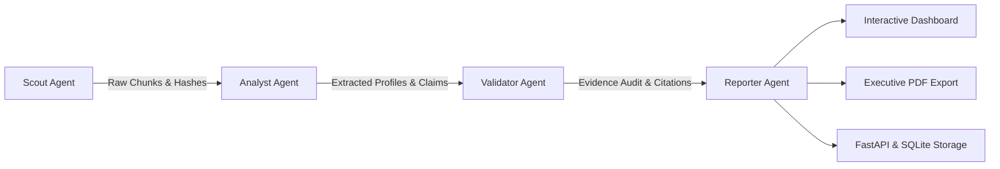

# AI Market Intelligence Agent — Multi-Agent Competitive Research System

An AI-powered multi-agent Python application that monitors publicly available competitor information, extracts structured market intelligence, validates AI-generated claims against source evidence, and produces executive-level competitive analysis reports.

---

## The Business Problem

Competitive research often requires teams to repeatedly monitor competitor websites, pricing, product launches, and industry news across multiple sources. 

Most generic AI scraping solutions simply pipe unstructured web dumps directly into a large language model and print a summary. This introduces two serious business hazards:
1. **Unchecked Hallucinations**: Generative models frequently confabulate pricing numbers, feature tiers, and enterprise capabilities.
2. **Lack of Auditability**: Decision-makers cannot verify whether an AI assertion originated from actual competitor copy or was synthesized out of thin air.

This system solves both problems by introducing an explicit, stateful **4-Agent Pipeline** governed by **LangGraph**, highlighted by a dedicated **Validator / Evidence Agent** that audits every extracted assertion against primary source documents before reports are published.

---

## Multi-Agent Architecture

The system orchestrates specialized agents through explicit state machine transitions:



### 1. Scout Agent (`src/agents/scout.py`)
- Collects public competitor data from pricing pages, feature specifications, and announcements using resilient HTTP and DOM parsing.
- Breaks unstructured web data into traceable `SourceChunk` records, stamped with unique hashes, competitor IDs, URLs, and timestamps.
- Features offline sample fixtures for reproducible local evaluation.

### 2. Analyst Agent (`src/agents/analyst.py`)
- Analyzes competitor source chunks to extract market positioning, pricing tiers, core service offerings, recent pivots, and SWOT profiles.
- Deconstructs findings into discrete, falsifiable factual assertions (`ClaimItem`), each tagged with category and alleged source IDs.

### 3. Validator / Evidence Agent (`src/agents/validator.py`)
> **Core AI Evaluation & Grounding Feature**
> Designed specifically around AI evaluation principles: verifying output reliability, ground-truth alignment, and citation accuracy.
- Performs automated cross-examination of every claim against collected source chunks.
- Computes token overlap, key term presence, and semantic alignment.
- Classifies each assertion into:
  - `VALIDATED`: Directly confirmed with extracted quotation and confidence $\ge 75\%$.
  - `REQUIRES_REVIEW`: Factual claim not corroborated by primary material (hallucination alert).
  - `LOW_CONFIDENCE`: Inferred from weak or ambiguous context.
- Aggregates an **Evidence Quality Report** with overall confidence percentages and citation mappings.

### 4. Reporter Agent (`src/agents/reporter.py`)
- Synthesizes validated findings into an executive briefing.
- Builds the **Competitive Landscape Matrix**, **Market Opportunities**, and **Recommended Strategic Actions**.
- Employs **ReportLab** to compile a publication-grade PDF report featuring formatted comparison tables, callouts, and evidence audit cards.

---

## Tech Stack

| Component | Technology | Purpose |
| :--- | :--- | :--- |
| **Orchestration** | **LangGraph** | Explicit state graph transitions (`Scout` $\to$ `Analyst` $\to$ `Validator` $\to$ `Reporter`) |
| **Data Contracts** | **Pydantic v2** | Strict validation of chunks, claims, landscape tables, and audit metrics |
| **REST API** | **FastAPI** + **Uvicorn** | Asynchronous service endpoints for headless enterprise integration |
| **Persistence** | **SQLite** | Zero-config, persistent storage for research runs, audits, and reports |
| **Interactive UI** | **Streamlit** | Live executive dashboard with agent progress and verification drill-down |
| **Visualizations** | **Plotly** | Evidence quality and confidence distribution charts |
| **Document Export**| **ReportLab** | Corporate PDF generation with tables, styles, and audit sections |
| **Testing** | **Pytest** | Comprehensive test suite (100% pass across agents, validator, graph, and API) |

---

## Sample Dashboard Output

### Competitive Landscape Matrix

| Competitor | Positioning | Pricing | Key Services | Recent Change |
| :--- | :--- | :--- | :--- | :--- |
| **Hostinger** | Aggressive Value / Budget Tier | ₹149/mo (Entry) | Shared, Managed WordPress, KVM VPS, AI Builder | Refreshed KVM VPS with AI Server Administration & AI Builder 2.0 |
| **Bluehost** | WordPress Recommended / SMB | ₹279/mo (Entry) | WordPress, Managed Cloud, WooCommerce | Launched Managed Cloud platform with 100% uptime SLA at ₹2,499/mo |
| **Cloudflare** | Enterprise Cloud & Edge Security | ₹1,650/mo (Pro) | Edge CDN, DDoS Protection, Workers, WAF | Unveiled Workers AI and automated Zero Trust security bundles |

### Market Opportunities
1. Competitor pricing models introduce steep renewal price hikes (up to 300%), creating an opening to offer transparent, lock-in-free renewal pricing.
2. Budget leaders rely heavily on automated AI builders and live chat but lack dedicated human onboarding and phone architecture support for growing SMBs.
3. Enterprise edge providers focus primarily on developer APIs, leaving mid-tier digital agencies underserved by unified hosting and security packages.

### Recommended Actions
1. Position hosting and digital services around *'Predictable Transparent Pricing'* with zero renewal spikes.
2. Bundle managed security (WAF + automated backups) as standard offerings rather than expensive enterprise add-ons.
3. Target agency partners migrating away from premium managed platforms by offering automated white-label migration tools and priority phone support.

### Evidence Quality & Reliability Audit
```
Evidence Quality Score: 87.5%
Claims Validated: 7 / 8
Claims Requiring Review: 1
Audited against source material by Validator Agent
```
- **CLM-001 (Hostinger - Pricing)**: `VALIDATED` (94% Confidence)  
  *Citation*: `"Hostinger provides aggressive value-tier web hosting starting at ₹149/month with free domain..."*
- **CLM-006 (Bluehost - Features)**: `REQUIRES_REVIEW` (20% Confidence)  
  *Evaluator Note*: *"Flagged: Statement claims free GPU compute, but source text contains no mention of GPU or free inference (potential hallucination)."*

---

## Project Structure

```
multi-agent/
├── fixtures/
│   └── sample_competitors.json   # Verified sample competitor dataset for instant offline runs
├── src/
│   ├── agents/
│   │   ├── scout.py              # Competitor data harvesting & chunking
│   │   ├── analyst.py            # Extraction of profiles and claims
│   │   ├── validator.py          # AI Evaluation: claim auditing & citation matching
│   │   └── reporter.py           # Synthesis & PDF compiling
│   ├── api/
│   │   └── main.py               # FastAPI REST endpoints
│   ├── graph/
│   │   └── workflow.py           # LangGraph StateGraph pipeline
│   ├── models/
│   │   ├── state.py              # TypedDict state and SourceChunk models
│   │   ├── intelligence.py       # CompetitorProfile & ExecutiveReport schemas
│   │   └── validation.py         # ClaimVerification & EvidenceQuality models
│   ├── services/
│   │   ├── scraper.py            # HTTP parser with fixture fallback
│   │   ├── llm_provider.py       # LLM provider with deterministic demo synthesis
│   │   ├── pdf_generator.py      # ReportLab PDF styling and builder
│   │   └── storage.py            # SQLite run storage
│   └── ui/
│       └── app.py                # Streamlit interactive dashboard
├── tests/
│   ├── test_agents.py            # Unit tests for Scout, Analyst, Reporter
│   ├── test_validator.py         # Unit tests for claim verification & confidence math
│   ├── test_graph.py             # LangGraph state machine integration tests
│   └── test_api.py               # FastAPI REST endpoint tests
├── requirements.txt
└── README.md
```

---

## Quickstart Guide

### 1. Installation

Clone repository and install requirements:
```bash
git clone https://github.com/iDesign-Group/multi-agent.git
cd multi-agent
pip install -r requirements.txt
```

### 2. Launch Streamlit Interactive UI

```bash
python -m streamlit run src/ui/app.py
```
Open your browser at `http://localhost:8501`. Enter your target company (e.g. `iDesign`), select competitor URLs, and click **"Run Multi-Agent Pipeline"**.

### 3. Launch FastAPI REST Backend

```bash
python -m uvicorn src.api.main:app --reload --port 8000
```
- Interactive Swagger UI: `http://localhost:8000/docs`
- Trigger analysis via POST:
```bash
curl -X POST "http://localhost:8000/api/research/run" \
     -H "Content-Type: application/json" \
     -d '{"company_name": "iDesign", "industry": "Web Hosting / Digital Services"}'
```

### 4. Run Test Suite

```bash
python -m pytest tests/ -v
```
All 10 unit and integration tests run in under 2 seconds.
